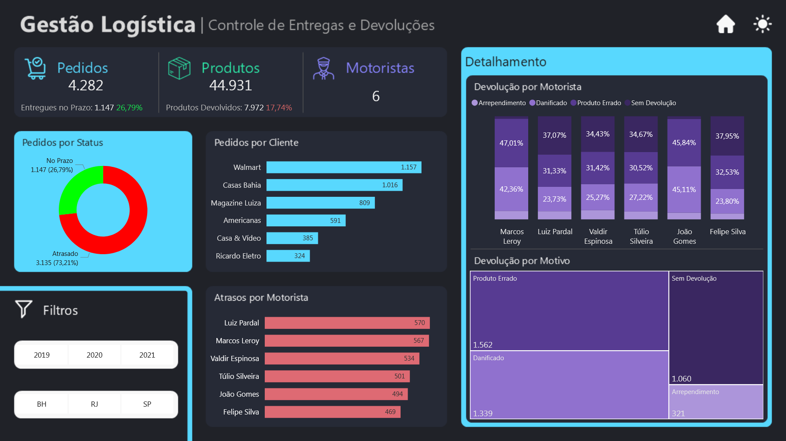

# 📦 Projeto Logística — TransFlow Logistics

## 📊 Visão Geral

Este projeto apresenta um **dashboard de gestão logística desenvolvido em Power BI**, criado para monitorar a eficiência operacional da empresa fictícia **TransFlow Logistics**.

A solução permite acompanhar indicadores críticos da operação, identificar gargalos logísticos e apoiar decisões estratégicas baseadas em dados.

🔎 **[Dashboard Interativo](https://app.powerbi.com/view?r=eyJrIjoiMWVhZGU1MjctYjVhMS00MjJlLWFiMWItZjk1OGJhODY5MjgzIiwidCI6IjIzY2FjN2VlLWYxZDgtNDMzOS1hYTdiLTc4MWFhOWY5MjI1YiJ9)**  

---

# 🧠 Contexto do Problema

A operação logística da **TransFlow Logistics** enfrentava desafios no monitoramento de:

- pedidos entregues no prazo
- desempenho de motoristas
- controle de devoluções
- visibilidade sobre clientes e volume de pedidos

Essas limitações dificultavam a identificação rápida de problemas operacionais e impactavam diretamente a eficiência da cadeia logística e a experiência do cliente.

---

# 🎯 Abordagem Estratégica

Para resolver esses desafios, foi desenvolvida uma solução analítica utilizando **Power BI**, estruturada com **modelagem dimensional** e indicadores estratégicos de performance.

O dashboard foi projetado para oferecer:

- leitura executiva clara
- monitoramento operacional detalhado
- navegação intuitiva entre métricas logísticas

### KPIs principais

- 📦 Quantidade de Pedidos
- 📦 Quantidade de Produtos
- 🚚 Quantidade de Motoristas

---

# 📈 Impactos e Resultados

A solução permite:

- identificar rapidamente **gargalos na operação logística**
- analisar **motoristas com maior índice de atraso**
- detectar **padrões de devoluções**
- monitorar **clientes com maior volume de pedidos**

Com isso, gestores conseguem tomar decisões mais rápidas e baseadas em dados.

---

# 🧩 Estrutura do Dashboard

## 📊 Indicadores Principais

O dashboard apresenta três cartões principais:

### Pedidos

- quantidade total de pedidos
- percentual de entregas realizadas no prazo

### Produtos

- quantidade total de produtos
- percentual de produtos devolvidos

### Motoristas

- quantidade total de motoristas ativos

---

# 📊 Visualizações Analíticas

## 🚚 Performance de Entregas

Gráfico de rosca mostrando:

- pedidos entregues no prazo
- pedidos atrasados
- percentual de cada categoria

---

## 👥 Pedidos por Cliente

Gráfico de barras horizontais que apresenta:

- quantidade de pedidos por cliente
- identificação dos clientes com maior volume de entregas

---

## ⏱️ Atrasos por Motorista

Gráfico de barras horizontais mostrando:

- número de atrasos registrados por motorista
- identificação de padrões de performance

---

## 🔁 Motivos de Devolução por Motorista

Gráfico de barras verticais empilhadas que apresenta:

- percentual de motivos de devolução
- relação entre devolução e motorista responsável

---

## 📦 Distribuição de Devoluções

Gráfico **Treemap** exibindo:

- quantidade de devoluções por motivo
- impacto relativo de cada causa

---

# 🎛️ Filtros Interativos

O dashboard permite análise dinâmica por:

- 📅 **Ano**
- 📍 **Estado**

Esses filtros permitem explorar diferentes cenários operacionais.

---

# 🎨 Experiência de Navegação

O dashboard inclui recursos de usabilidade e design:

- 🌙 **Modo Dark (padrão)**
- ☀️ **Modo Light opcional**
- 🔎 botão **Analisar**
- 🏠 botão para retornar à **Home**

Esses elementos melhoram a experiência de exploração dos dados.

---

# 🛠️ Stack Técnica

- Microsoft Power BI
- DAX (Data Analysis Expressions)
- Modelagem Dimensional
- Storytelling com Dados

---

# 🧱 Modelagem de Dados

O modelo foi estruturado utilizando **modelagem dimensional**, com tabelas principais:

### Tabelas Fato

- pedidos
- entregas
- devoluções

### Tabelas Dimensão

- clientes
- motoristas
- produtos
- localização

Essa estrutura permite maior eficiência analítica e melhor performance do modelo.

---

# 📸 Preview do Dashboard

## Documentação das Medidas

Para consultar a documentação das medidas deste projeto, suas fórmulas e descrições, acesse a [Documentação das Medidas](docs/medidas-documentacao.md).

# 👨‍💻 Autor

Projeto desenvolvido como parte do meu portfólio profissional em **Business Intelligence e Data Analytics**, destacando habilidades avançadas e aplicáveis a diversos cenários analíticos:

- Desenvolvimento de **dashboards executivos e painéis estratégicos**, focados em insights acionáveis e tomada de decisão baseada em dados  
- **Modelagem dimensional e relacional**, aplicando corretamente **cardinalidade, granularidade** e hierarquias entre tabelas para garantir consistência e integridade dos dados  
- **Transformação de dados com Power Query e Linguagem M**, criando pipelines eficientes, automatizados e auditáveis  
- Criação de **KPIs estratégicos e métricas customizadas em DAX**, para análise de performance e comparações confiáveis  
- **Integração de múltiplas fontes de dados** (Excel, SQL, APIs, arquivos planos), padronizando e validando informações críticas  
- **Data storytelling e visualizações interativas**, com cores, hierarquias, filtros e destaque de insights, para facilitar interpretação e engajamento do usuário  
- **Análises estatísticas e preditivas**, usando Python, R, regressões, teste de hipóteses, séries temporais e técnicas de Machine Learning para identificação de tendências e padrões  
- **Automatização e otimização de processos analíticos**, incluindo ETL, scripts e compressão de dados, garantindo performance e escalabilidade dos relatórios  
- **Documentação detalhada de medidas, tabelas, modelos e processos**, permitindo reprodutibilidade, transparência e governança dos dados  
- Aplicação de **boas práticas de engenharia de dados**, integrando análise, estatística, IA e visualização para soluções analíticas completas e confiáveis  
- Domínio completo de **Power BI, DAX, Power Query, Python e R**, com foco em performance, qualidade e entrega de insights estratégicos

---

  
**Portfólio de Business Intelligence & Data Analytics**  

| [LinkedIn](https://www.linkedin.com/in/rogerioclynton/) | [Portfólio](https://www.clyntonchronos.com) |

